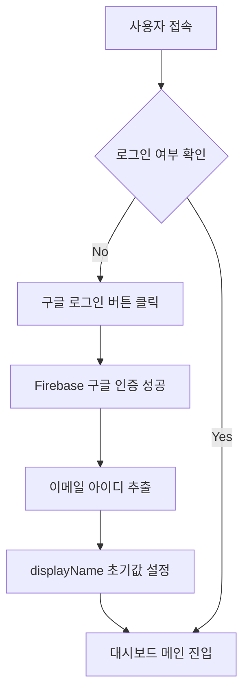
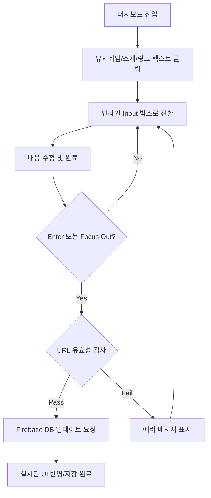
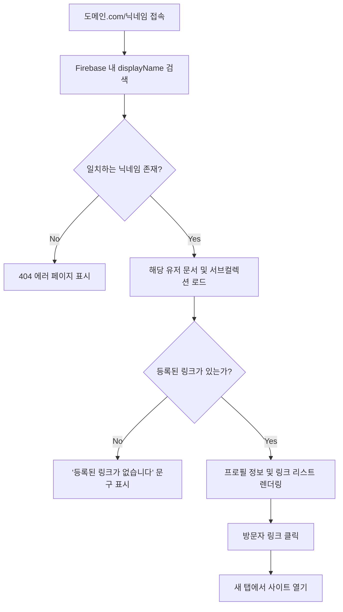

# 마이링크(MyLink) 서비스 로직 순서도

## 1. 사용자 온보딩 및 초기 설정 흐름
> 사용자가 처음 접속하여 닉네임을 부여받는 과정입니다.

## 2. 대시보드 데이터 관리 (CRUD) 흐름
> 소유자가 프로필과 링크를 인라인 편집을 통해 수정하는 과정입니다.

## 3. 방문자 접속 및 페이지 렌더링 로직
> 외부 사용자가 URL을 통해 접속했을 때의 내부 처리 과정입니다.

## 4. 로직 부가 설명
1. **이메일 아이디 추출 (Onboarding)**: 사용자가 구글로 로그인하면 메인 이메일 주소의 `@` 앞부분을 자동으로 추출하여 사용자 주소(Link Slug)의 초기값인 `displayName`으로 할당합니다.
2. **실시간 저장 방식 (Dashboard)**: 사용자가 수정 중이던 입력을 마치고(Focus Out) 엔터를 치면 즉시 서버와 동기화가 이루어지며, 작업 확인 모달을 띄우지 않아도 즉각적으로 값이 반영됩니다.
3. **URL 주소 확인 (Visitor Access)**: `displayName` 필드를 기반으로 Firebase에서 해당 문서를 쿼리하여 사용자를 식별합니다. 일치하는 결과가 없을 시 즉시 404 안내 페이지로 안내됩니다.
