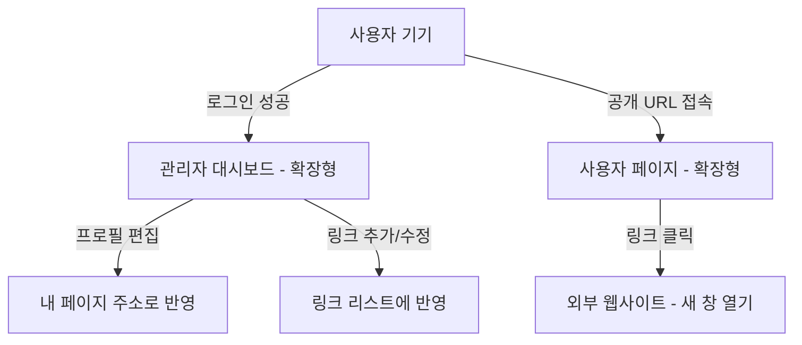

# 마이링크(MyLink) 와이어프레임 정의서

## 1. 개략적인 서비스 레이아웃 구조 (Mermaid)



---

## 2. 화면 상세 설계 (ASCII Art)

### 2-1. 로그인 페이지 (Login Page)
> 매우 간결하게 서비스를 체험할 수 있도록 구글 로그인 버튼 하나만 가운데 크게 배치합니다.

```text
+-------------------------------------------------------------+
|                                                             |
|                      M Y L I N K                            |
|                  하나의 링크로 소통하세요                   |
|                                                             |
|                 [   G   Login with Google   ]               |
|                                                             |
+-------------------------------------------------------------+
```

### 2-2. 관리자 대시보드 (Admin Dashboard)
> 자신의 주소를 관리하고 인라인 편집을 수행하는 관리자 공간입니다. (데스크톱 확장형)

```text
+-------------------------------------------------------------+
|  MYLINK [ Dashboard ]         [Copy My URL] [ 로그아웃 ]   |
+-------------------------------------------------------------+
|                                                             |
|  [     관리자 정보 (프로필) 영역 - 인라인 편집 가능      ]  |
|                                                             |
|       유저네임: [홍 길 동 (클릭 시 입력창으로 변환)]        |
|       닉 네 임: [gildong      ] (URL: mylink.com/gildong)   |
|       상세소개: [안녕하세요. 인플루언서 홍길동입니다.     ] |
|                                                             |
+-------------------------------------------------------------+
|                                                             |
|  [                     + 링크 추가                        ] |
|                                                             |
+-------------------------------------------------------------+
|                                                             |
|  [ 링크 리스트 영역 ]                                       |
|  +-------------------------------------------------------+  |
|  | [Icon]  내 인스타그램 주소 (클릭 시 인라인 수정)      |  |
|  |         http://instgram.com/gildong (클릭 시 수정)    |  |
|  |                                          [ 삭제 ]     |  |
|  +-------------------------------------------------------+  |
|                                                             |
|  +-------------------------------------------------------+  |
|  | [Icon]  [ (입력 중...) 내 유튜브                     ] |  |
|  |         [ http://youtube.com/channel/gildong         ] |  |
|  |                                          [ 삭제 ]     |  |
|  +-------------------------------------------------------+  |
|                                                             |
+-------------------------------------------------------------+
```

### 2-3. 사용자 공개 페이지 (Profile Page)
> 방문자가 실제로 보게 되는 최종 결과 화면입니다. (데스크톱 확장형으로 좌우로 풍성하게 노출)

```text
+-------------------------------------------------------------+
|                                                             |
|                      [  유 저 네 임  ]                      |
|                  안 녕 하 세 요 . 홍 길 동 입 니 다 .        |
|                      (mylink.com/gildong)                   |
|                                                             |
+-------------------------------------------------------------+
|                                                             |
|        [ (Icon)   블로그 보러가기                   ]       |
|                                                             |
+-------------------------------------------------------------+
|                                                             |
|        [ (Icon)   구독하기 (유튜브)                 ]       |
|                                                             |
+-------------------------------------------------------------+
|                                                             |
|        [ (Icon)   포트폴리오 보러가기               ]       |
|                                                             |
+-------------------------------------------------------------+
```

---

## 3. UI 컴포넌트 및 동작 명세

1. **상단바 (Header/Navigation)**
   - **Logo**: 서비스 홈 이동 
   - **Copy My URL**: 클릭 시 클립보드로 `mylink.com/닉네임` 주소 자동 복사
   - **Logout**: 파이어베이스 로그아웃 처리 후 로그인 페이지 이동

2. **인라인 수정 (Inline Editor)**
   - 텍스트 상태에서 클릭 시 즉시 `Input` 상자로 교체
   - 입력 완료 후 `Enter` 또는 `Focus Out` 시 실시간으로 DB 업데이트 
   - 유효하지 않은 URL 입력 시 입력창 하단에 빨간색 에러 텍스트 표시

3. **링크 아이템 (Link Item Card)**
   - **Left Icon**: 구글 파비콘 API를 호출하여 해당 URL의 아이콘 자동 렌더링 
   - **Link Text**: 직관적인 버튼 이름 
   - **Target**: 모든 링크 클릭 시 `_blank` 속성을 주어 새 탭에서 열기 처리 
   - **Delete**: 재확인 모달을 띄운 후 최종 삭제 진행 

4. **레이아웃 확장 정책**
   - **Mobile**: 화면 크기에 따라 100% 가득 차는 카드 형태
   - **Desktop/Tablet**: `max-width`가 과도하지 않은 선에서 화면 해상도에 맞춰 컨텐츠 너비가 자연스럽게 늘어남 (shadcn UI의 `container` 클래스 등 활용) 
